<div align="center">

# 🚀 Hacking.Co Workflow Platform

### **Next-Generation Enterprise Automation with Swarm Intelligence**

[](LICENSE)
[](https://hacking.co)
[](https://langfuse.com)
[](https://www.typescriptlang.org/)
[](docs/SWARM-ARCHITECTURE.md)

<br/>


<br/>

### **Transform Your Enterprise with Collective Intelligence**

[🎯 Get Started](#-quick-start) • [🐝 Swarm Features](#-swarm-intelligence) • [📊 Case Studies](#-proven-results) • [📧 Contact](#-get-in-touch)

<br/>

```ascii
╔══════════════════════════════════════════════════════════════╗
║   Trusted by Fortune 500 • 84.8% Success Rate • 4.4x Faster  ║
╚══════════════════════════════════════════════════════════════╝
```

</div>

---

## 🌟 Why Hacking.Co?

> **We don't just automate workflows—we orchestrate intelligent swarms that think, learn, and evolve.**

<table>
<tr>
<td width="50%">

### 📈 **Enterprise Performance**
- **84.8%** task completion rate
- **4.4x** faster than traditional automation
- **32.3%** reduction in operational costs
- **99.9%** uptime SLA

</td>
<td width="50%">

### 🏆 **Industry Recognition**
- Gartner Cool Vendor 2024
- Forbes Cloud 100 Rising Star
- ISO 27001 & SOC 2 Certified
- 500+ Enterprise Deployments

</td>
</tr>
</table>

## 🐝 Swarm Intelligence

```mermaid
graph LR
    A[🧠 Hive Mind] --> B[🤖 Agent Swarm]
    B --> C[⚡ Parallel Execution]
    C --> D[📊 Real-time Analytics]
    D --> E[🎯 Business Outcomes]
```

<div align="center">



</div>

### **🚀 Core Capabilities**

<table>
<tr>
<td width="33%">

#### 🧠 **Collective Intelligence**
- Self-organizing agent swarms
- Consensus-based decisions
- Shared memory & learning
- Neural pattern recognition

</td>
<td width="33%">

#### ⚡ **Hyper-Performance**
- Parallel task execution
- Auto-scaling architecture
- Real-time optimization
- Sub-second response times

</td>
<td width="33%">

#### 🔍 **Full Observability**
- Langfuse integration
- End-to-end tracing
- Performance analytics
- Predictive monitoring

</td>
</tr>
</table>

### **🛠️ Enterprise Features**

- **🔐 Security**: Zero-trust architecture, E2E encryption, SOC 2 & ISO 27001
- **🌐 Integration**: 500+ connectors, REST/GraphQL APIs, Webhooks
- **📈 Analytics**: Real-time dashboards, custom metrics, ML insights
- **🎯 Automation**: No-code designer, code-first options, hybrid workflows

## 💡 Quick Start

<div align="center">

### **Get running in under 5 minutes**

</div>

```bash
# 1️⃣ Clone & Install
git clone https://github.com/hackingco/workflow.git && cd workflow
npm install

# 2️⃣ Configure
cp .env.example .env
# Add your Langfuse keys for observability

# 3️⃣ Launch Swarm
npm run swarm:init
```

<details>
<summary><b>🎯 Try Our CLI</b></summary>

```bash
# Start an intelligent swarm
swarm start --name "my-automation" --agents 8 --strategy auto

# Monitor in real-time
swarm monitor --dashboard

# Execute complex workflows
swarm task create --file workflows/enterprise-pipeline.yaml
```

</details>

<details>
<summary><b>🐝 Code Example</b></summary>

```typescript
import { SwarmCoordinator, LangfuseTracer } from '@hackingco/workflow';

// Initialize with full observability
const swarm = new SwarmCoordinator({
  name: 'DataPipeline',
  agents: 10,
  strategy: 'auto',
  tracing: new LangfuseTracer()
});

// Execute with collective intelligence
await swarm.execute({
  tasks: ['analyze', 'process', 'optimize'],
  parallel: true,
  consensus: true
});
```

</details>

📚 **Full Documentation**: [docs.hacking.co](https://docs.hacking.co)

## 🎯 Use Cases

<div align="center">

### **See How Industry Leaders Transform with Hacking.Co**

</div>

<table>
<tr>
<td width="50%">

### 💰 **Financial Services**
```yaml
Industry: Banking & Insurance
Challenge: Manual loan processing
Solution: Swarm-powered automation
Results:
  - 75% faster processing
  - $4.2M annual savings
  - 99.8% accuracy rate
```

</td>
<td width="50%">

### 🏥 **Healthcare**
```yaml
Industry: Hospital Network
Challenge: Patient data workflows
Solution: HIPAA-compliant swarms
Results:
  - 90% compliance improvement
  - 60% staff time saved
  - Zero security breaches
```

</td>
</tr>
<tr>
<td width="50%">

### 🏭 **Manufacturing**
```yaml
Industry: Global Supply Chain
Challenge: Inventory optimization
Solution: Predictive swarm analytics
Results:
  - 40% inventory reduction
  - Real-time tracking
  - $2.5M cost savings
```

</td>
<td width="50%">

### 🛒 **E-Commerce**
```yaml
Industry: Online Retail
Challenge: Order fulfillment
Solution: Intelligent routing
Results:
  - 4x order capacity
  - Same-day delivery
  - 98% satisfaction rate
```

</td>
</tr>
</table>

## 📊 Proven Results

<div align="center">

```
┌─────────────────────────────────────────────────────────────┐
│                    CLIENT SUCCESS METRICS                    │
├─────────────────┬───────────────┬─────────────┬────────────┤
│ Average ROI     │ Time to Value │ Cost Saved  │ Efficiency │
│ 385% Year 1     │ < 30 Days     │ $2.8M Avg   │ +420%      │
└─────────────────┴───────────────┴─────────────┴────────────┘
```

</div>

## 🏗️ Architecture

```mermaid
graph TD
    A[🌐 Client Applications] --> B[⚡ API Gateway]
    B --> C[🐝 Swarm Orchestrator]
    C --> D[🤖 Agent Pool]
    C --> E[🧠 Hive Mind]
    D --> F[📊 Langfuse Tracing]
    E --> F
    F --> G[💾 Data Lake]
    
    style C fill:#1E40AF,stroke:#10B981,stroke-width:4px
    style E fill:#10B981,stroke:#F59E0B,stroke-width:4px
```

<div align="center">



</div>

### **Tech Stack**
- **Core**: TypeScript, Node.js, Event-Driven Architecture
- **AI/ML**: TensorFlow, GPT-4, Custom Neural Networks
- **Observability**: Langfuse, Prometheus, Grafana
- **Infrastructure**: Kubernetes, AWS/Azure/GCP, Terraform
- **Security**: Zero-Trust, E2E Encryption, HSM

## 📧 Get in Touch

<div align="center">

### **Ready to Transform Your Enterprise?**

<table>
<tr>
<td align="center" width="33%">

### 📞 **Direct Contact**
**Email**: admin@hacking.co  
**Phone**: 1-800-HACK-PRO  
**Sales**: sales@hacking.co

</td>
<td align="center" width="33%">

### 🌐 **Online Resources**
**Website**: [hacking.co](https://hacking.co)  
**Docs**: [docs.hacking.co](https://docs.hacking.co)  
**Status**: [status.hacking.co](https://status.hacking.co)

</td>
<td align="center" width="33%">

### 💬 **Community**
**GitHub**: [@hackingco](https://github.com/hackingco)  
**LinkedIn**: [/company/hackingco](https://linkedin.com/company/hackingco)  
**Twitter**: [@hackingco](https://twitter.com/hackingco)

</td>
</tr>
</table>

<br/>

<a href="https://hacking.co/demo">
  
</a>
&nbsp;
<a href="https://hacking.co/trial">
  
</a>
&nbsp;
<a href="mailto:admin@hacking.co">
  
</a>

</div>

---

<div align="center">

### **🚀 Hacking.Co - Where Innovation Meets Enterprise Scale**

<br/>

```
Copyright © 2025 Hacking.Co | All Rights Reserved
Enterprise Software License | SOC 2 Type II Certified | ISO 27001
```

<br/>

<sub>Built with ❤️ and 🐝 by the Hacking.Co Team</sub>

</div>